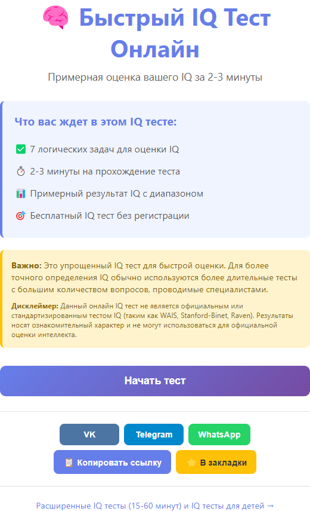
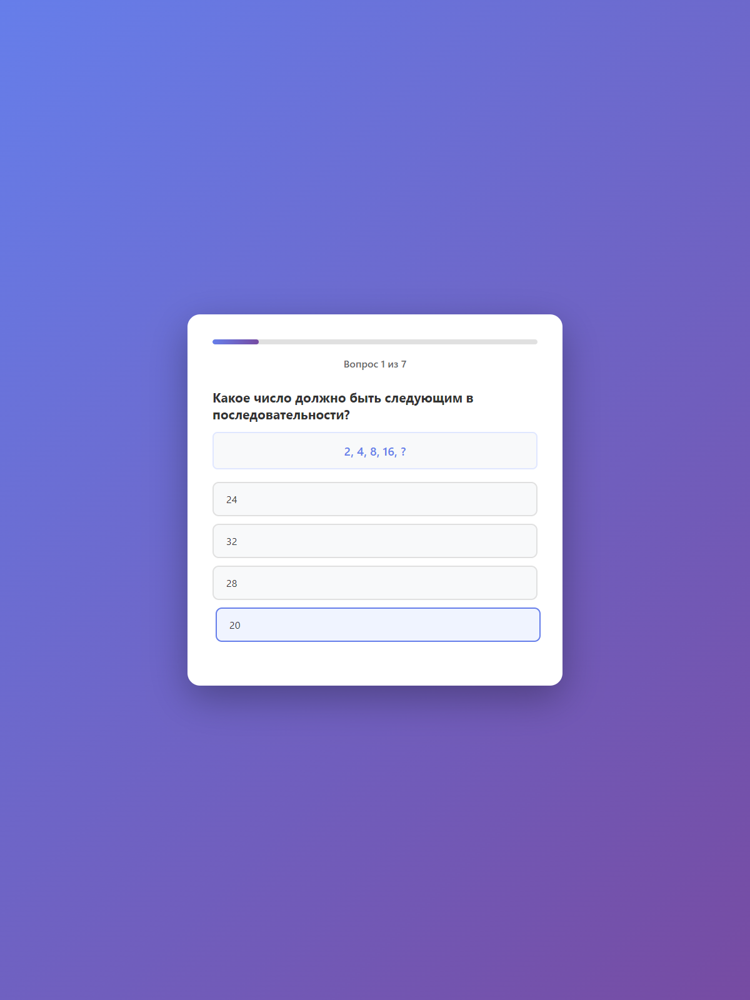
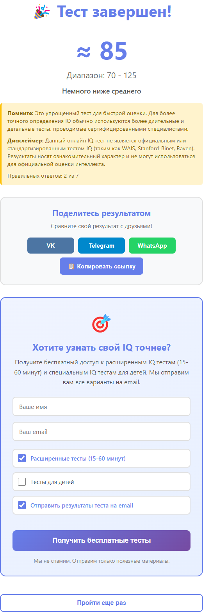
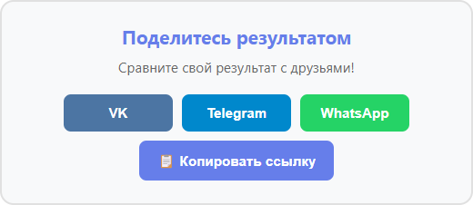
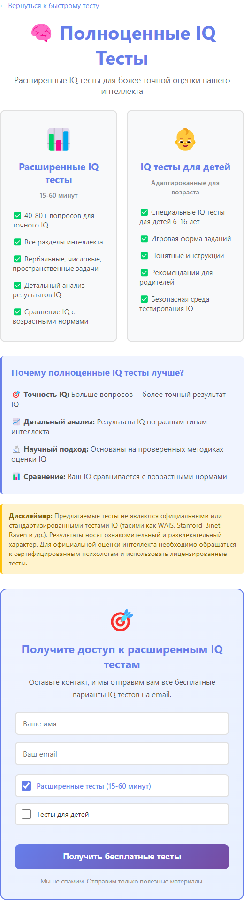

# Дневник проекта: IQ Тест Онлайн

## Обзор проекта

**Название**: IQ Тест Онлайн - Быстрый тест интеллекта

**Цель**: Создать простой и быстрый онлайн тест для оценки интеллекта, который:
- Занимает 2-3 минуты
- Дает примерный результат IQ с диапазоном
- Собирает контакты для будущих расширенных тестов
- Позволяет делиться результатами

**Технологии**: 
- HTML5, CSS3, Vanilla JavaScript
- Без фреймворков и зависимостей
- Статический сайт, готов к деплою на любом хостинге

**Деплой**: Cloudflare Pages (планируется)

---

## Этап 1: Создание MVP быстрого IQ теста

**Дата**: 2025-01-27

### Что было

Нужно было создать простой быстрый IQ тест, который:
- Коррелирует с IQ (хотя бы частично)
- Занимает 5-10 минут (или даже 1 минуту)
- Выдает результат с диапазоном (например, "примерно 120, но между 100 и 160")
- Очень простой, MVP

### Решение

Создан MVP быстрого IQ теста с следующими характеристиками:

1. **7 вопросов разных типов**:
   - Числовые последовательности (2, 4, 8, 16...)
   - Аналогии (книга : страница = дом : ?)
   - Логические задачи
   - Простая математика
   - Паттерны

2. **Быстрое прохождение**: 2-3 минуты

3. **Результат с диапазоном**:
   - Примерный IQ (например, ≈120)
   - Широкий диапазон (например, 100-160)
   - Предупреждение о неточности быстрого теста

4. **Современный UI**:
   - Градиентный фон
   - Прогресс-бар
   - Подсветка правильных/неправильных ответов
   - Адаптивный дизайн

5. **Форма сбора контактов**:
   - После прохождения теста
   - Предложение расширенных тестов (15-60 минут)
   - Предложение тестов для детей
   - Опция отправки результатов на email

6. **Функционал поделиться**:
   - Кнопки для VK, Telegram, WhatsApp
   - Копирование ссылки
   - Добавление в закладки
   - На стартовой странице и на странице результатов

7. **Страница расширенных тестов**:
   - Отдельная страница с описанием полноценных тестов
   - Та же форма сбора контактов

### Почему такое решение

- **Vanilla JavaScript**: Проект простой, не нужны фреймворки. Быстрая загрузка, нет зависимостей.
- **7 вопросов**: Баланс между скоростью и информативностью. Можно расширить позже.
- **Широкий диапазон**: Честно показывает неточность быстрого теста, не вводит в заблуждение.
- **Сбор контактов**: Два места сбора - после теста (когда пользователь заинтересован) и на странице расширенных тестов.
- **Поделиться**: Вирусный маркетинг - пользователи делятся результатами, привлекают друзей.

### Плюсы

- ✅ Быстрая реализация MVP
- ✅ Нет зависимостей, быстрая загрузка
- ✅ Простой деплой (статический сайт)
- ✅ Сбор контактов для будущих тестов
- ✅ Вирусный потенциал через поделиться
- ✅ Юридически корректно (дисклеймеры о неофициальности теста)
- ✅ SEO-оптимизировано (много упоминаний "IQ тест")

### Минусы

- ❌ Только 7 вопросов - недостаточно для точной оценки
- ❌ Упрощенная формула расчета IQ (не научная)
- ❌ Нет отправки email (только подготовка)
- ❌ Нет бэкенда для сохранения результатов

### Подводные камни

- **Юридические**: Добавлены дисклеймеры о том, что это не официальные тесты (WAIS, Stanford-Binet, Raven)
- **SEO vs Юридические**: Баланс между использованием "IQ" для SEO и юридической корректностью
- **Формула IQ**: Упрощенная модель, не научная. Важно не претендовать на точность
- **Email**: Пока только подготовка шаблона, нужно будет подключить EmailJS/Resend

### Что сделано

- ✅ Создана структура проекта (HTML, CSS, JS)
- ✅ 7 вопросов разных типов
- ✅ Логика теста с подсчетом баллов
- ✅ Алгоритм расчета IQ с диапазоном
- ✅ Современный UI с градиентами и анимациями
- ✅ Форма сбора контактов (2 места)
- ✅ Функционал поделиться (VK, Telegram, WhatsApp, копирование ссылки)
- ✅ Добавление в закладки
- ✅ Страница расширенных тестов
- ✅ Дисклеймеры о неофициальности теста
- ✅ SEO-оптимизация (meta-теги, ключевые слова)
- ✅ Адаптивный дизайн
- ✅ Подготовка шаблона email с результатами
- ✅ Настроена автоматизация скриншотов (Puppeteer)

### Скриншоты

Скриншоты основных экранов приложения:

1. **Приветственный экран** - главная страница с описанием теста



2. **Экран с вопросом** - процесс прохождения теста



3. **Экран с результатами** - показ результата IQ с диапазоном



4. **Блок поделиться** - кнопки для распространения результатов



5. **Форма сбора контактов** - предложение расширенных тестов


6. **Страница расширенных тестов** - описание полноценных тестов



### Как создать скриншоты

#### Вариант 1: Автоматически (если работает)

1. Установите зависимости: `npm install`
2. Запустите скрипт: `npm run capture:screens`
3. Скриншоты будут сохранены в `screenshots/ru/`

#### Вариант 2: Вручную (рекомендуется)

1. **Создайте папку для скриншотов**:
   ```
   mkdir screenshots\ru
   ```

2. **Откройте `index.html` в браузере** (просто двойной клик или через Live Server)

3. **Сделайте скриншоты следующих экранов**:
   
   - **01-welcome-screen.png** - Приветственный экран (главная страница)
     - Просто откройте `index.html` и сделайте скриншот всей страницы
   
   - **02-test-question.png** - Экран с вопросом теста
     - Нажмите "Начать тест"
     - Сделайте скриншот экрана с вопросом
   
   - **03-result-screen.png** - Экран с результатами
     - Пройдите все 7 вопросов (можно выбирать любые ответы)
     - Сделайте скриншот экрана с результатами (IQ, диапазон, описание)
   
   - **04-share-buttons.png** - Блок с кнопками поделиться
     - На странице результатов сделайте скриншот блока "Поделитесь результатом"
   
   - **05-contact-form.png** - Форма сбора контактов
     - На странице результатов сделайте скриншот формы "Хотите узнать свой IQ точнее?"
   
   - **06-full-tests-page.png** - Страница расширенных тестов
     - Откройте `full-tests.html` в браузере
     - Сделайте скриншот всей страницы

4. **Сохраните скриншоты**:
   - Назовите файлы точно как указано выше (01-welcome-screen.png, 02-test-question.png и т.д.)
   - Сохраните в папку `screenshots/ru/`
   - Рекомендуемый размер: ширина 1200px или больше

5. **Проверьте, что все скриншоты на месте**:
   ```
   screenshots/
   └── ru/
       ├── 01-welcome-screen.png
       ├── 02-test-question.png
       ├── 03-result-screen.png
       ├── 04-share-buttons.png
       ├── 05-contact-form.png
       └── 06-full-tests-page.png
   ```

**Советы**:
- Используйте инструменты браузера для скриншотов (F12 → Device Toolbar для мобильной версии)
- Или используйте расширения браузера (например, "Awesome Screenshot")
- Или используйте встроенные инструменты Windows (Win+Shift+S) / Mac (Cmd+Shift+4)
- Убедитесь, что скриншоты четкие и хорошо видны все элементы интерфейса

### Файлы проекта

- `index.html` - главная страница с тестом
- `full-tests.html` - страница расширенных тестов
- `style.css` - стили
- `script.js` - логика теста
- `full-tests.js` - логика страницы расширенных тестов

### Будущие улучшения

- [ ] Подключить отправку email (EmailJS/Resend)
- [ ] Добавить больше вопросов (10-15)
- [ ] Реализовать расширенные тесты (15-60 минут)
- [ ] Тесты для детей
- [ ] Сохранение результатов в базу данных
- [ ] Статистика и сравнение с другими пользователями
- [ ] Таймер на каждый вопрос
- [ ] Разные уровни сложности

---

## Метрики

- Время разработки MVP: ~2 часа
- Количество вопросов: 7
- Время прохождения теста: 2-3 минуты
- Размер проекта: ~15 KB (без зависимостей)

---

## Уроки и выводы

1. **Простота важна**: Vanilla JS оказался достаточным для MVP, не нужны были фреймворки
2. **Юридические аспекты**: Важно сразу добавить дисклеймеры, чтобы не было проблем
3. **SEO vs Юридические**: Можно использовать "IQ" для SEO, но с четкими дисклеймерами
4. **Сбор контактов**: Два места сбора увеличивают конверсию
5. **Поделиться**: Вирусный потенциал важен для роста

